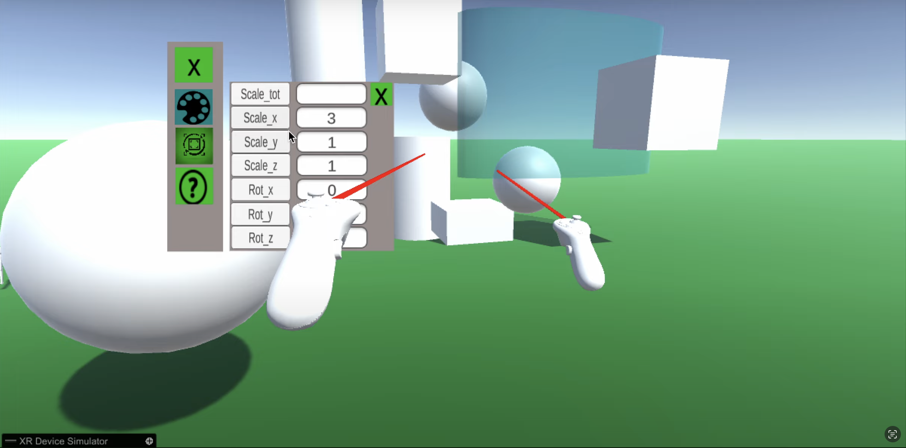

# PAi CAD VR Project

This project is a Computer-Aided Design (CAD) application developed for Virtual
Reality (VR) environments using Unity. It can export the shapes the user built
in the software into .STEP and .OBJ format.

## Project Overview
Developed as part of the [Projet d'Application Industrielle
(PAi)](https://offre-formation.ec-lyon.fr/en/node/48534998) at [École Centrale
de Lyon (ECL)](https://www.ec-lyon.fr/en), this project was completed between
October 2025 and April 2026. The team dedicated 6 hours per week to development,
consisting of 7 Master's students in General Engineering.

### Sponsorship
[ASSYSTEM](https://www.assystem.com/en/) sponsored this project and retains
ownership of the source code. While communication documents (including software
architecture) are available in this repository, the source code itself is not
publicly accessible.

## Project Demonstration
View the final product demonstration on
[YouTube](https://youtube.com/embed/JCr8g94aiuc)
<iframe src="https://youtube.com/embed/JCr8g94aiuc"></iframe>

## Development Team
- **Ulysse DURAND** - Team Manager & Software Architect 
- **Saadia LAAMECH** - Product Designer & UI/UX Specialist  
- **Mathieu LONDICHE** - Lead Unity/C# Developer 
- **Ahmadou SOUM** - Unity/C# Developer 
- **Oumaima LAKLOUCH** - Client Relations Coordinator & C# Developer 
- **Ibtihal BOUDRAA** - Documentation & Production Management 
- **William SANAA** - State of the Art Research

## Documentation
All documents are in French. Please note half of the team members were
non-native French speakers.

Available documents: 

- [Final Report](assets/Final_Report.pdf) - Comprehensive project documentation
including: 
  - Project timeline and milestones 
  - Management artifacts (GANTT charts, tools) 
  - Market research 
  - Client requirements 
  - Design decisions 
  - Software architecture 
  - Team feedback 

- [Slides](assets/Slides.pdf) - Used during the final 20 minutes long oral
  presentation

- [Kick-Off Meeting Sheet](assets/Kick_Off_Meeting.pdf) - First project
  document filled with client during the first meeting including: 
  - Context 
  - Objectives 
  - Ressources and constraints
  - First idea of the outline

- [Design Document](assets/Doc_Design.pdf) - Contains the UX and UI choices
  made by the Product Designer, it is meant to communicate with the Software
Developers

## Acknowledgments
We extend our gratitude to: 

- Rémi FAVIER (ASSYSTEM) - Our client and project sponsor 
- Patrick SERRAFERO (ECL) - Our academic advisor
